

# TravelAssistant

## Your Travel Companion Anywhere in the World

Plan your trip. Discover places. Find the best way to get there.  
Manage travel essentials. Ask your AI travel assistant.

Screenshots from the live app · Expo Web · iPhone-sized viewport

## 1. What is TravelAssistant?

TravelAssistant brings the important parts of traveling into one app.

- Discover attractions, food, and hotels nearby
- Get directions and compare travel modes
- Check weather and convert currencies
- Browse trip suggestions and save plans (when signed in)
- Ask an AI travel assistant about places, routes, and budgets
- Find eSIM offers and emergency help near you
- Save favorites and build a simple offline pack

① Choose your city · ② Plan trips & suggestions · ③ Ask AI · ④ Open Explore

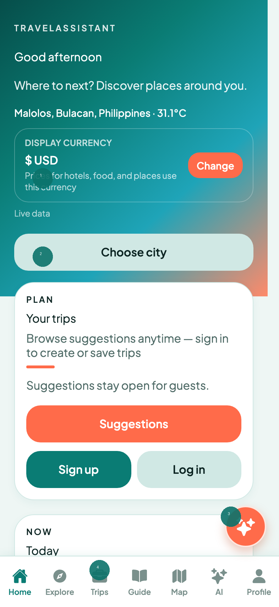

## 2. Welcome / Home (guest)

You can browse as a guest. Sign in when you want to save trips and favorites.

From Home you can:

- Choose a city
- Open **Suggestions**
- **Sign up** or **Log in**

**Simple flow:** Open app → Choose city → Explore nearby → Sign in to save trips.

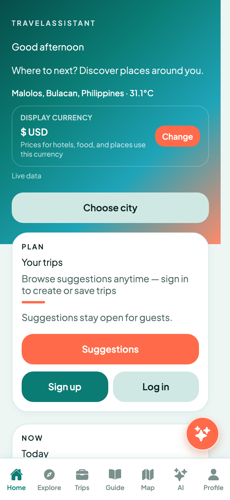

## 3. Create an account

1. Enter your name, email, and password.
2. Confirm your email if asked.
3. Sign in to continue.

After signup you can save trips, favorites, and preferences.

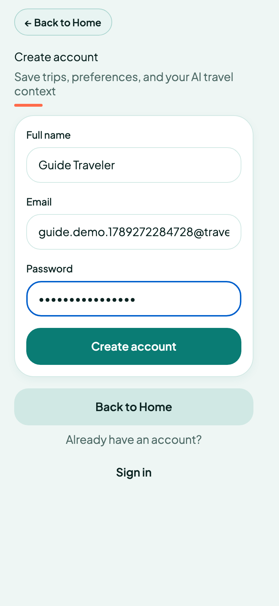

## 4. Sign in

Ways to sign in:

- Email and password
- Continue with Google (when enabled)
- Magic link (passwordless email)
- Or go **Back to Home** to keep browsing as a guest

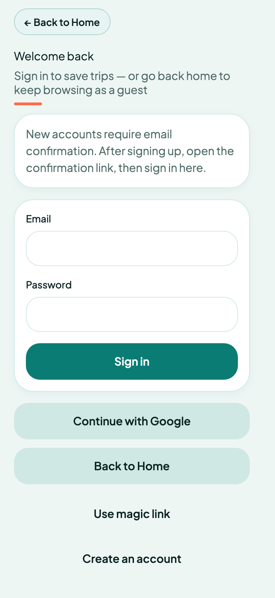

## 5. Home

Home shows where you are, the weather, your display currency, and quick ways to plan.

- **Choose city** — set the location for nearby results
- **Display currency** — prices use the currency you pick
- **Plan** — trip suggestions, or sign in to create trips
- **Today** — weather and helpful notes
- **Orange sparkle** — open the AI assistant

Bottom tabs: **Home · Explore · Trips · Guide · Map · AI · Profile**

## 6. Explore

Discover things to do around your destination or current location.

① Choose city · ② Distance · ③ Category

- Filter by distance (a few hundred meters up to 200 km)
- Pick a category: Things to do, Food, Hotels, Parks, Museums, and more
- Tap a place card to open details

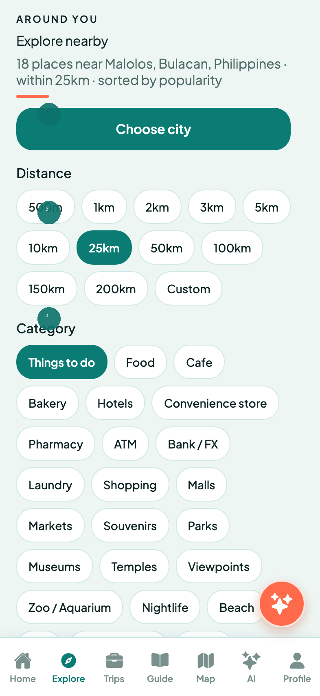

## 7. Place details

On a place screen you can usually see:

- Name, category, and distance
- Photos (when available)
- Address, notes, rating, and estimated price band
- Opening hours when listed
- Community photos & reviews when available

From here open **Directions**, or save the place after you sign in.

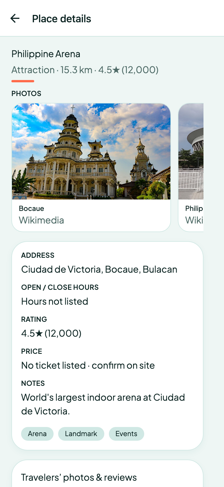

## 8. Trip suggestions (guests)

**Sign in is required** to open the full Create Trip wizard.

Guests can still:

- Browse ready-made trip ideas
- Open a suggestion for details
- Sign in later to save it as a trip

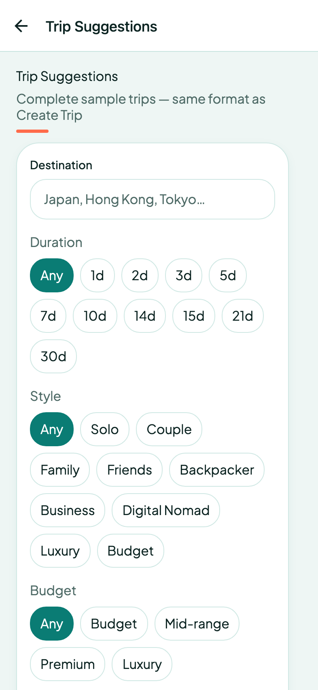

## 9. Generate a plan for a city

1. Enter a city
2. Pick travel dates
3. Generate a day-by-day suggestion from nearby places

**Create Trip wizard (signed in)** covers destination, dates, travelers, style, interests, budget, transport, hotel, then review under **My Trips**.

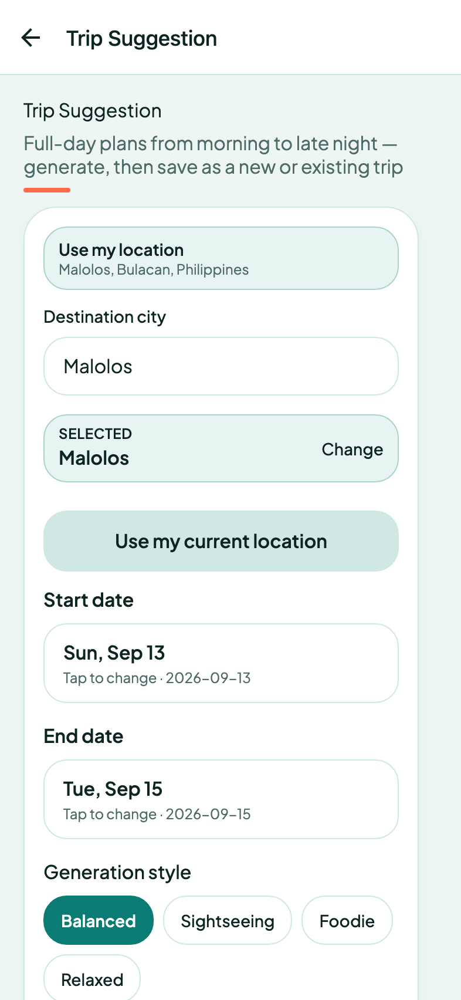

## 10. Ways to start a plan

| Option | Who | What it does |
|--------|-----|--------------|
| **Suggestions** | Everyone | Curated trip templates |
| **Trip suggestion** | Everyone | City itinerary |
| **Create Trip** | Signed-in | Full wizard |
| **AI → planner** | Everyone | Ask AI to plan a day |

Prefer the itinerary shown in the app after generating a suggestion.

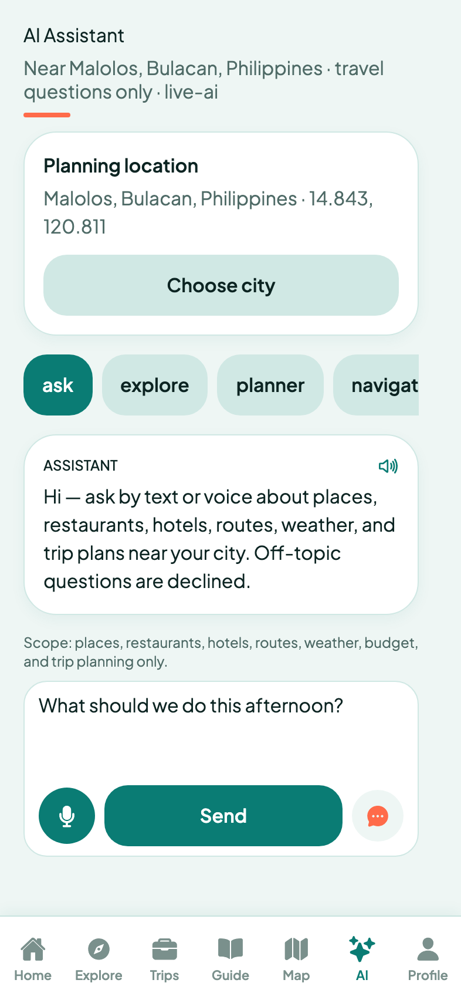

## 11. My Trips

- Guests see a prompt to sign up / log in
- Signed-in travelers see saved trips, dates, and destinations
- Open a trip for itinerary, map, hotels, and budget

**Itinerary tip:** Days, activity times, places, notes, and map stops live on the trip. **Optimize day** sorts by time only — it does not recalculate live routes.

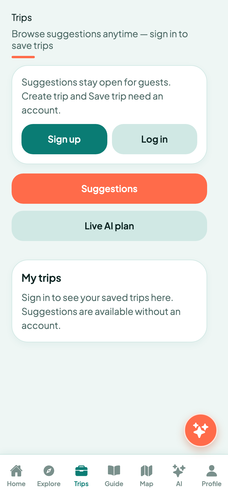

## 12. Map

Use the map to see places around you.

- Your location when available
- Nearby attractions as markers
- Map / Terrain / Satellite layers
- Zoom controls
- Tap a place to open details

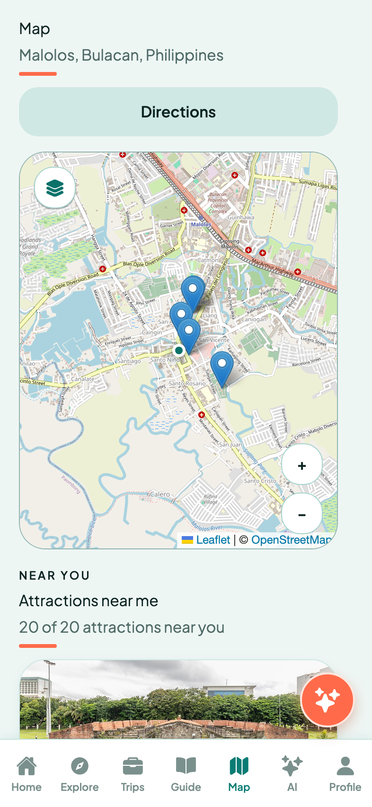

## 13. Directions & transport

1. Start from **Your location** (or pick another origin)
2. Search for a destination
3. Choose a mode: **Best, Drive, Walk, Cycle** (and more when available)
4. Review the route on the map and the step list

Driving, walking, and cycling use live road data when available. Bus, train, rideshare, and flight options may be estimated — not live schedules or ticket prices.

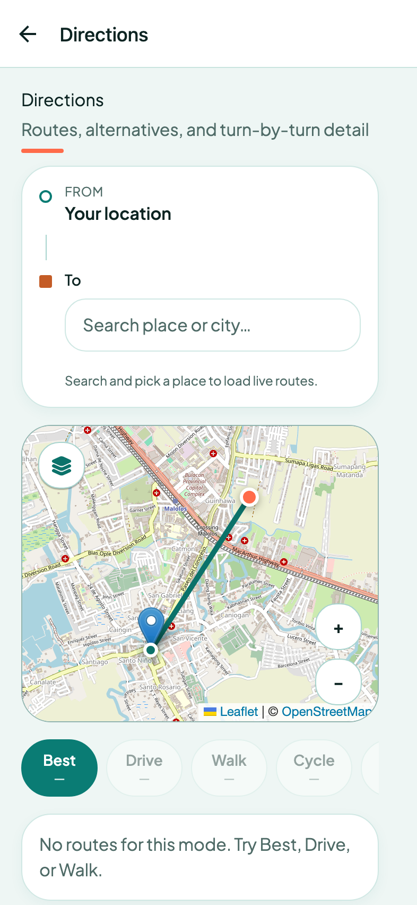

## 14. AI Travel Assistant

Ask TravelAssistant questions while planning or traveling.

① Modes · ② Assistant reply · ③ Type or speak

**Modes:** ask · explore · planner · navigator · emergency · budget

Try asking:

- “What should we do this afternoon?”
- “Where should we eat nearby?”
- “How do I get to the nearest museum?”
- “Is the weather good for outdoor plans?”

You can type or use the microphone. The assistant focuses on travel topics only.

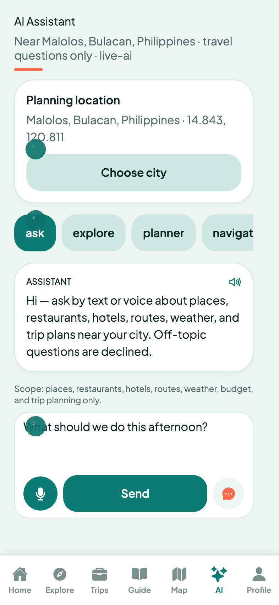

## 15. Hotels

Find places to stay near your destination.

- Search by city and dates
- See hotel name, location, and distance when available
- Open a hotel for more detail and directions

Live booking rates depend on the connected hotel provider. Confirm prices with the hotel or booking site.

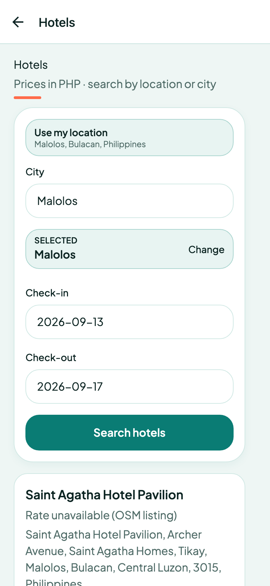

## 16. Currency converter

- Select from and to currencies
- Enter an amount
- See the converted value and recent rate trend

Rates come from a live exchange feed. Bank fees are not included.

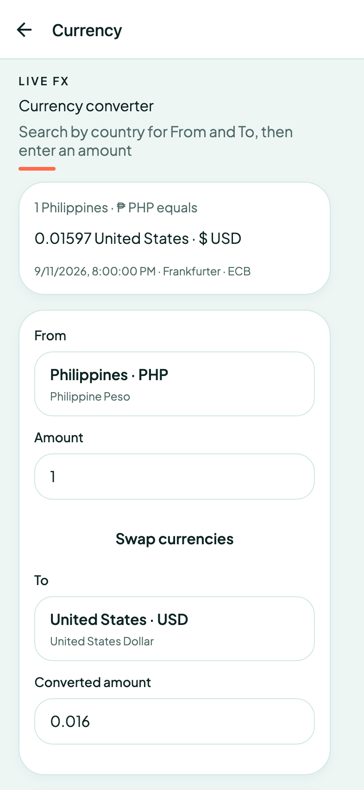

## 17. Travel budget

Keep track of how much you plan to spend and how much you have already spent.

- Budgets are tied to a trip
- Open a trip first
- Add expenses by category (food, transport, attractions, and more)

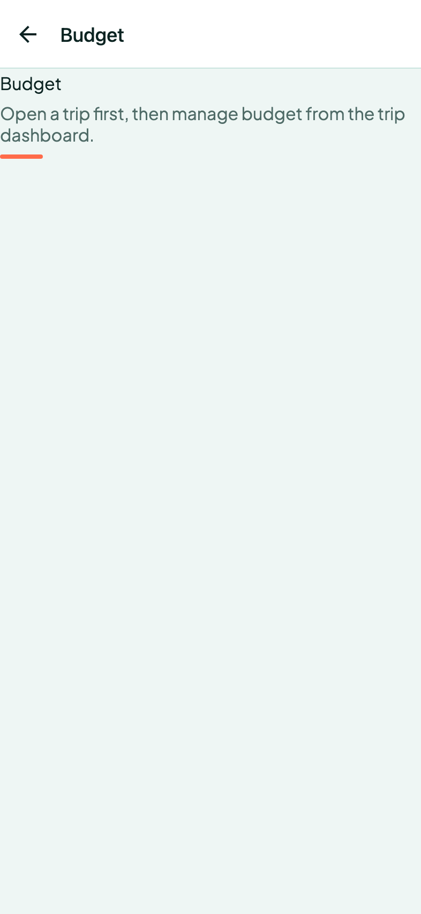

## 18. Weather

Check the weather before planning your day.

- Current conditions for your city
- Multi-day forecast
- Switch outdoor plans to indoor ones when it rains

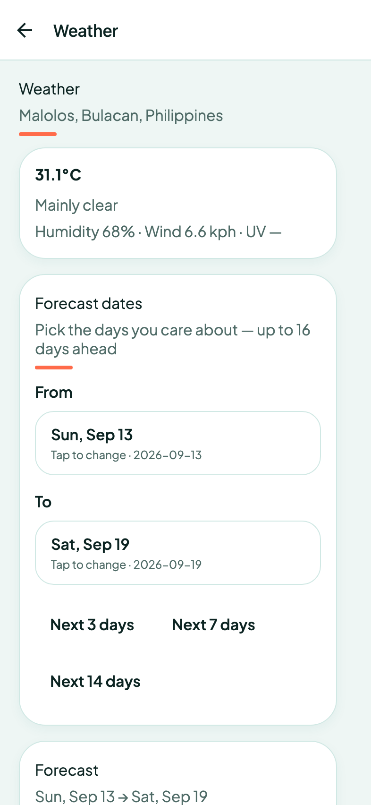

## 19. eSIM

Find mobile-data options for your destination.

- Choose a country
- Compare data amount, validity, and listed price
- Tap to view the offer on the provider’s site

Purchases happen outside TravelAssistant.

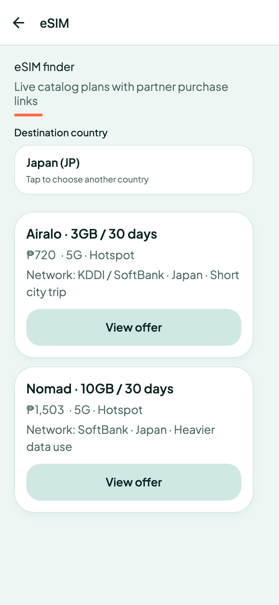

## 20. Emergency

Quickly find important help near you.

- Local emergency numbers (police / ambulance / fire)
- Nearby hospitals, clinics, and pharmacies
- Police and embassy search for your country

Always verify numbers on the ground — lists can change.

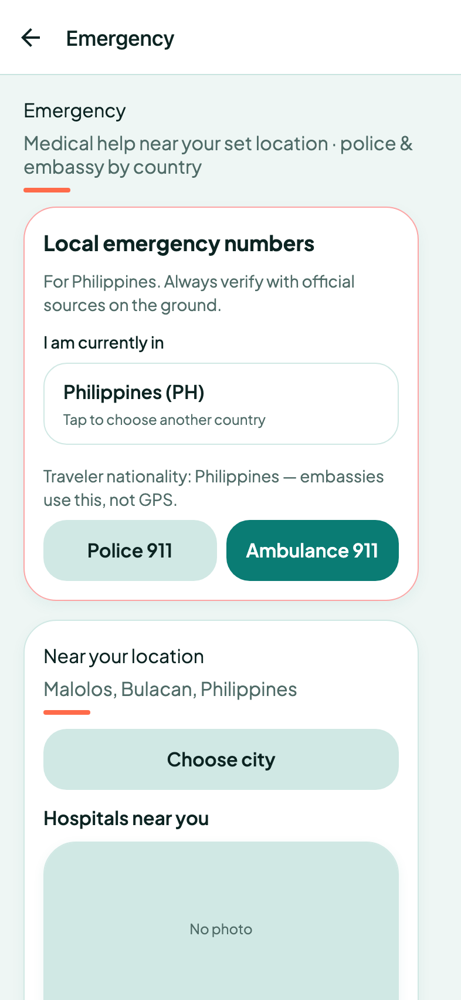

## 21. Favorites

Save places you want to remember or visit later.

Sign in to keep favorites across sessions and devices.

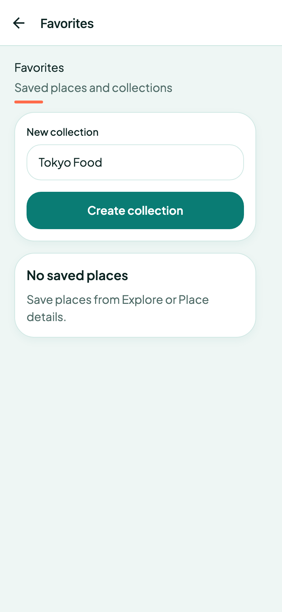

## 22. Offline travel

On **Profile**, signed-in travelers can **Build offline pack**.

What is cached today:

- Your saved trips (summary)
- Emergency numbers snapshot
- Recently viewed places and routes you already opened

This is not a full offline map. An offline banner appears when your connection drops.

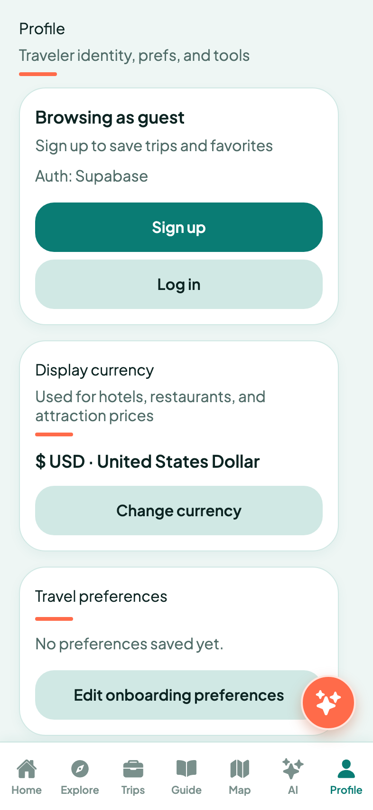

## 23. Notifications

See in-app alerts such as sample weather, transit, or budget reminders.

Push notifications and live disruption alerts are limited in the current build — treat the list as in-app messages.

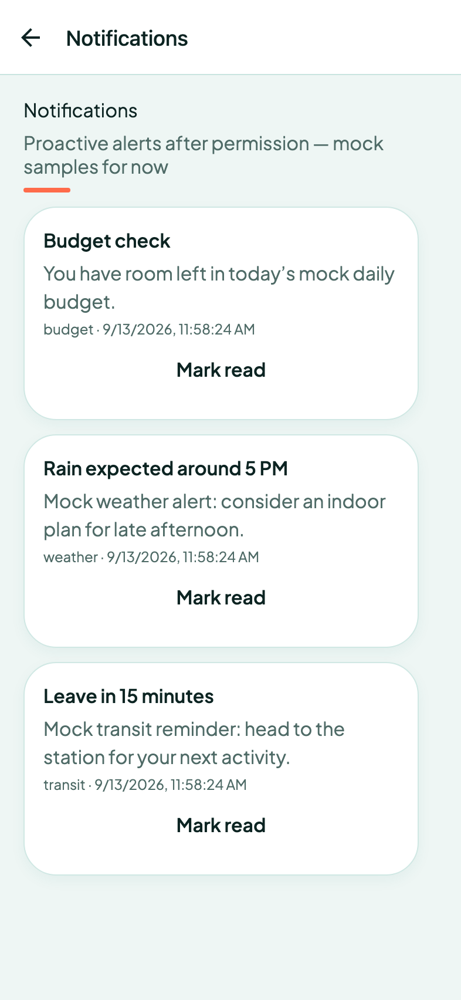

## 24. Profile

Manage:

- Sign in / sign out
- Display currency
- Travel preferences (from onboarding)
- Theme (light / dark / system)
- Shortcuts to Guide, Favorites, Currency, eSIM, Weather, Emergency, Notifications
- Offline pack

## 25. Example: planning a Japan trip

**Home** → Choose city / Suggestions

↓ Trip suggestions or Trip suggestion for Tokyo

↓ Sign in → **Create Trip** (dates, travelers, interests, budget, transport)

↓ Review itinerary in **My Trips**

↓ **Explore** · **Map** · **Directions**

↓ **Weather** · **Currency** · **AI Assistant** while you travel

## 26. Search

Find places and jump to your trips from the search screen.

Use it when you already know a place name or want to hop into a saved trip quickly.

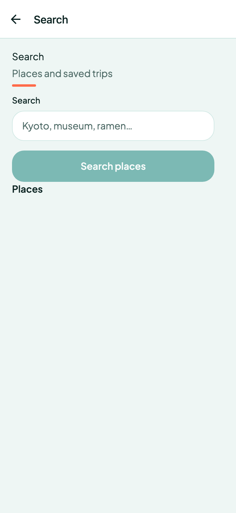

## 27. Guide

Browse traveler spots and public trips shared by the community.

A good place to get inspiration before you create your own plan.

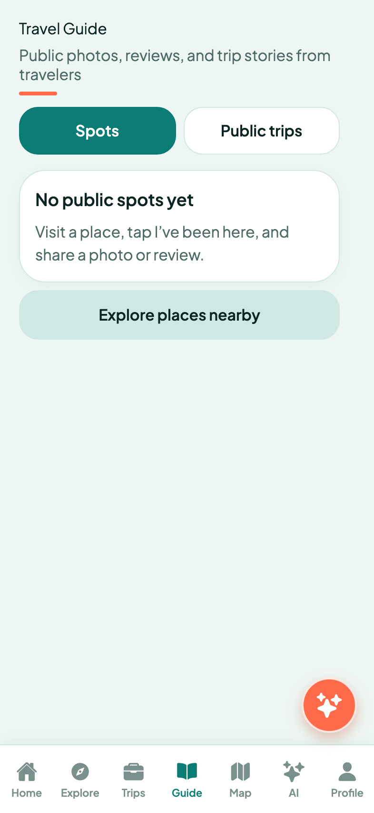

## 28. Magic link

Sign in with an email link instead of a password.

1. Enter your email
2. Open the link from your inbox
3. Continue into the app

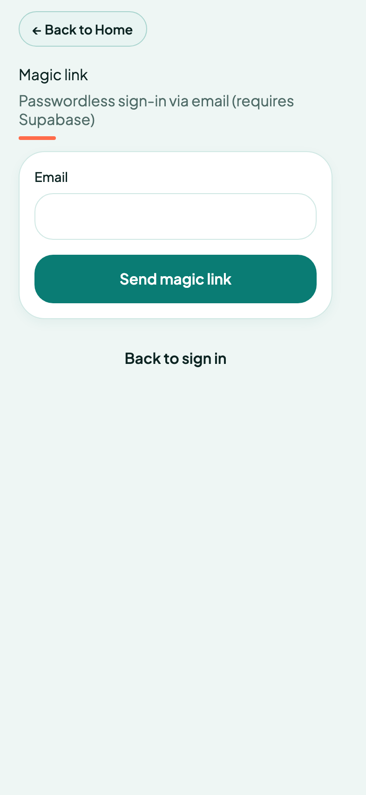

## Tips for a great first trip

1. Set your **display currency** on Home.
2. **Choose city** before Explore or AI.
3. Browse as a guest, then **sign in** to save.
4. Confirm prices, hours, and emergency numbers on site.
5. Ask AI for ideas — then verify routes on Directions.

---

*Features documented match the current TravelAssistant product.*

